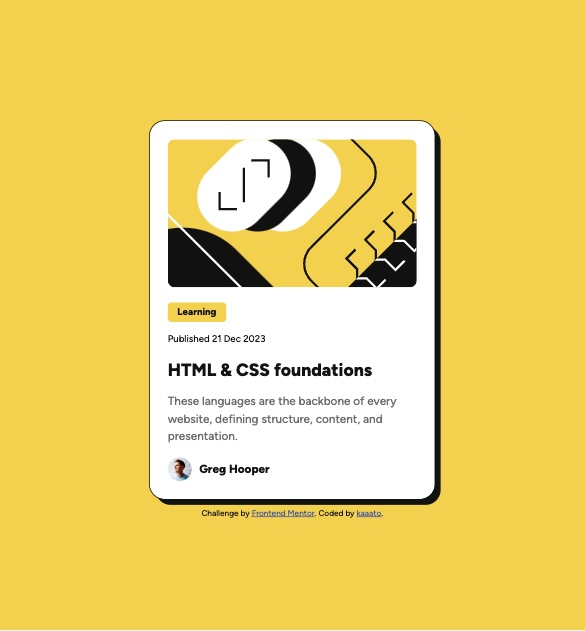

# Frontend Mentor - Blog preview card solution

This is a solution to the [Blog preview card challenge on Frontend Mentor](https://www.frontendmentor.io/challenges/blog-preview-card-ckPaj01IcS). Frontend Mentor challenges help you improve your coding skills by building realistic projects. 

## Table of contents

- [Overview](#overview)
  - [The challenge](#the-challenge)
  - [Screenshot](#screenshot)
  - [Links](#links)
- [My process](#my-process)
  - [Built with](#built-with)
  - [What I learned](#what-i-learned)
  - [Continued development](#continued-development)
  - [Useful resources](#useful-resources)
- [Author](#author)
- [Acknowledgments](#acknowledgments)

## Overview

This challenge is completed with HTML and CSS.

### The challenge

Users should be able to:

- See hover and focus states for all interactive elements on the page

### Screenshot



### Links

- Solution URL: [solution URL](https://github.com/kaaato/blog-preview-card)
- Live Site URL: [live site URL](https://kaaato.github.io/blog-preview-card/)

## My process

1. Do research about things that I didn't know from reading through the guideline. This is actually required throughout the process.
2. Start HTML with semantic elements and try to make a layout that help to style easier with css later.
3. Start CSS after completing the first draft of HTML. 
4. Go back and update both files wherever necessary.

### Built with

- Semantic HTML5 markup
- CSS custom properties
- Flexbox
- Things I learnt from previous challenge
- [CSS reset](https://piccalil.li/blog/a-more-modern-css-reset/) - Andy Bell

### What I learned

- How to use and write @font-face{}

```css
@font-face {
  font-family: "femFigtree";
  src: url("assets/fonts/Figtree-VariableFont_wght.ttf") format("truetype");
}
```

- Flexbox

### Continued development

- Choice of HTML elements, naming HTML classes and layout design in general.

### Useful resources

I used the following sites to learn Flexbox.

- [web.dev](https://web.dev/learn/css/flexbox?continue=https%3A%2F%2Fweb.dev%2Flearn%2Fcss%23article-https%3A%2F%2Fweb.dev%2Flearn%2Fcss%2Fflexbox)
- [smashingmagazine.com](https://www.smashingmagazine.com/2018/08/flexbox-display-flex-container/) - a series of articles about Flexbox are helpful

## Author

## Acknowledgments

